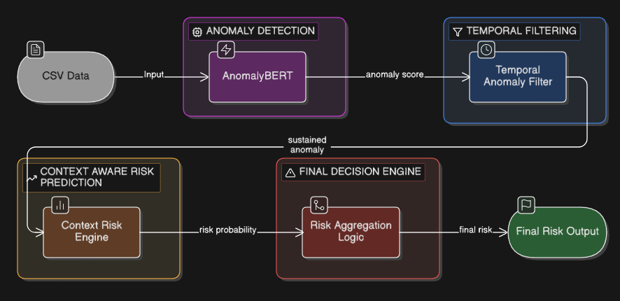
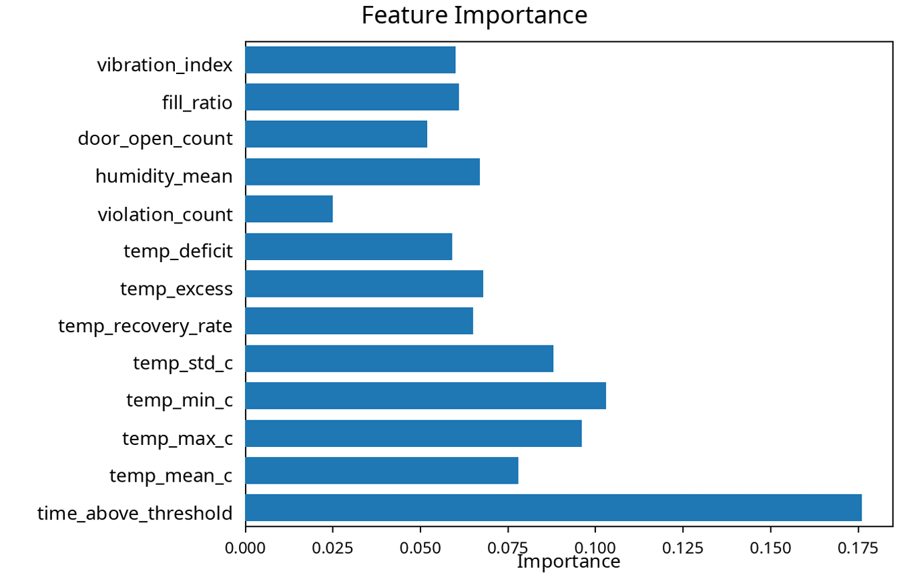
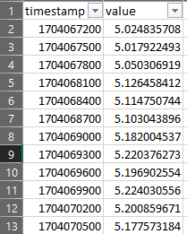
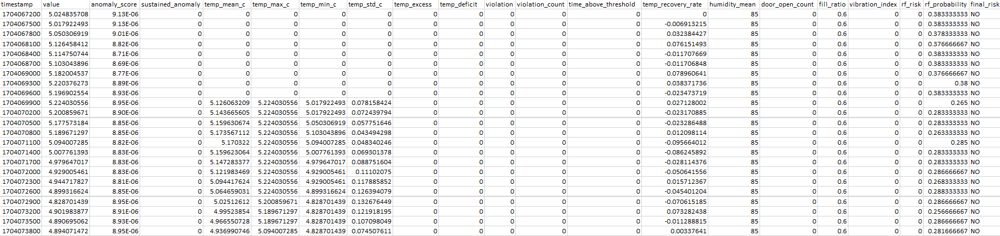

# Cold Chain Anomaly & Risk Detection System

<br>

## Introduction

This project implements an intelligent cold-chain monitoring system designed to detect and assess temperature-related risks in real time. Traditional systems rely on simple threshold-based rules (e.g., temperature > 8°C), which often produce false alarms and fail to capture gradual or sustained failures.

<br>

This system improves upon that by combining:

- Deep learning-based anomaly detection
- Temporal persistence analysis
- Context-aware risk prediction

<br>

> The result is a multi-stage pipeline that evaluates not only whether a temperature reading is abnormal, but also whether it is sustained and how severe the overall risk is.

---

<br>

## System Architecture (4-Stage Model)

The system is built as a four-stage pipeline:



<br>

### Stage 1: Anomaly Detection (AnomalyBERT)

This stage uses a transformer-based model to analyze temperature sequences and assign an anomaly score to each timestamp.

- Input: timestamp, temperature
- Output: anomaly_score (continuous value)

> The model learns normal temporal patterns and identifies deviations based on sequence behavior rather than static thresholds.


<br>

### Stage 2: Temporal Filtering (Time-Aware Memory)

This stage introduces time-awareness into the system.

- Tracks whether anomalies persist over multiple consecutive readings
- Filters out short-lived spikes or sensor noise

**Logic:**

> If anomaly_score exceeds a threshold (e.g., 0.6) for a sustained number of steps (e.g., 3), it is considered a real anomaly.

**Output:**

- sustained_anomaly (0 or 1)


<br>

### Stage 3: Context-Aware Risk Prediction (Random Forest)

This stage evaluates the severity of the situation using engineered features.

**Features Used for Risk Prediction:**

| Feature | Description |
|--------|------------|
| temp_mean_c | Average temperature over a window |
| temp_max_c | Maximum temperature observed |
| temp_min_c | Minimum temperature observed |
| temp_std_c | Temperature variability (standard deviation) |
| time_above_threshold | Duration for which temperature stayed outside safe range |
| violation_count | Number of times temperature crossed threshold limits |
| temp_recovery_rate | Rate at which temperature returns to normal |
| temp_excess | Amount above upper threshold (8°C) |
| temp_deficit | Amount below lower threshold (2°C) |
| humidity_mean | Average humidity (placeholder feature) |
| door_open_count | Number of times storage door was opened |
| fill_ratio | Storage capacity usage |
| vibration_index | External disturbance indicator |

<br>

**Model:**

- Random Forest Classifier

<br>

**Output:**

- Risk probability
- Binary classification (safe/risk)

<br>

**Feature Importance:**




<br>

### Stage 4: Final Risk Engine

This stage combines outputs from all previous stages to produce a final, actionable risk level.

While earlier stages focus on detection and analysis, this stage is responsible for **decision-making**. It integrates anomaly severity, temporal persistence, rule-based validation, and contextual risk into a single unified output.

<br>

#### Inputs to the Risk Engine

| Input | Description | Source |
|------|------------|--------|
| anomaly_score | Degree of abnormality in temperature | Stage 1 (AnomalyBERT) |
| sustained_anomaly | Whether anomaly persists over time | Stage 2 (Temporal Filter) |
| rule_violation | Whether temperature is outside 2–8°C | Rule-based logic |
| rf_probability | Risk likelihood from Random Forest | Stage 3 |

<br>


#### Risk Classification Levels

| Level | Description | Interpretation |
|------|------------|----------------|
| NO | Safe | No significant anomaly detected |
| LOW | Minor Issue | Small or short-lived deviation |
| MEDIUM | Moderate Risk | Sustained or repeated anomaly |
| CRITICAL | High Risk | Severe and prolonged violation |


<br>

#### Key Insight

This stage transforms raw model outputs into **human-interpretable decisions**.

Instead of relying on a single signal, it ensures that:
- short-term noise is ignored  
- sustained anomalies are prioritized  
- contextual factors influence severity  

This makes the system suitable for real-world deployment where both accuracy and reliability are critical.

---

<br>

## Input and Output


### Input

The system takes a CSV file containing time-series temperature data.

<div align="center">



</div>


**Required format:**

```
timestamp,value
1700000000,5.2
1700000300,5.3
```

Place inside:

```
./spoilage_detection/python/
```


<br>

### Output

After running the pipeline, a file named:

```
final_output.csv
```

is generated in the same directory.

<div align="center">



</div>

This file contains:

- anomaly_score
- sustained_anomaly
- Random Forest predictions
- final_risk classification

---

<br>

## Installation and Setup

### Step 1: Clone the repository

```
git clone <your-repo-url>
cd spoilage_detection
```


<br>

### Step 2: Install dependencies

```
pip install -r requirements.txt
```

(Ensure PyTorch and anomalybert are installed)


<br>

### Step 3: Download Random Forest Model

Due to its size (~1GB), the Random Forest model is hosted externally.

Download it from:

https://huggingface.co/anubhav-m/context-aware-risk-prediction-system-random-forest/tree/main

After downloading:

- Place the file inside:
  
  ```
  ./spoilage_detection/models/
  ```
  
- Do NOT rename the file


<br>

### Step 4: Prepare input data

Place your CSV file inside:

```
./spoilage_detection/python/
```

Update the filename inside `final.py` if needed.

<br>

### Step 5: Run the pipeline


```
cd python
python final.py
```

<br>

### Step 6: Check output

The result will be saved as:

```
final_output.csv
```

---

<br>

## Training Datasets

The folder:

```
./training_datasets/
```

contains the datasets used to train:

- The transformer-based anomaly detection model (Stage 1)
- The Random Forest risk prediction model (Stage 3)

These are provided for reference and reproducibility but are not required for running the system.

---

<br>

## Key Advantages

- Detects gradual failures, not just sudden spikes
- Reduces false positives using temporal filtering
- Incorporates contextual features for better risk assessment
- Modular pipeline that can be extended to real-time systems

---

<br>

## Future Improvements


- Real-time streaming integration
- Web-based dashboard and alert system
- ONNX model deployment for lightweight inference
- Integration with IoT sensor pipelines